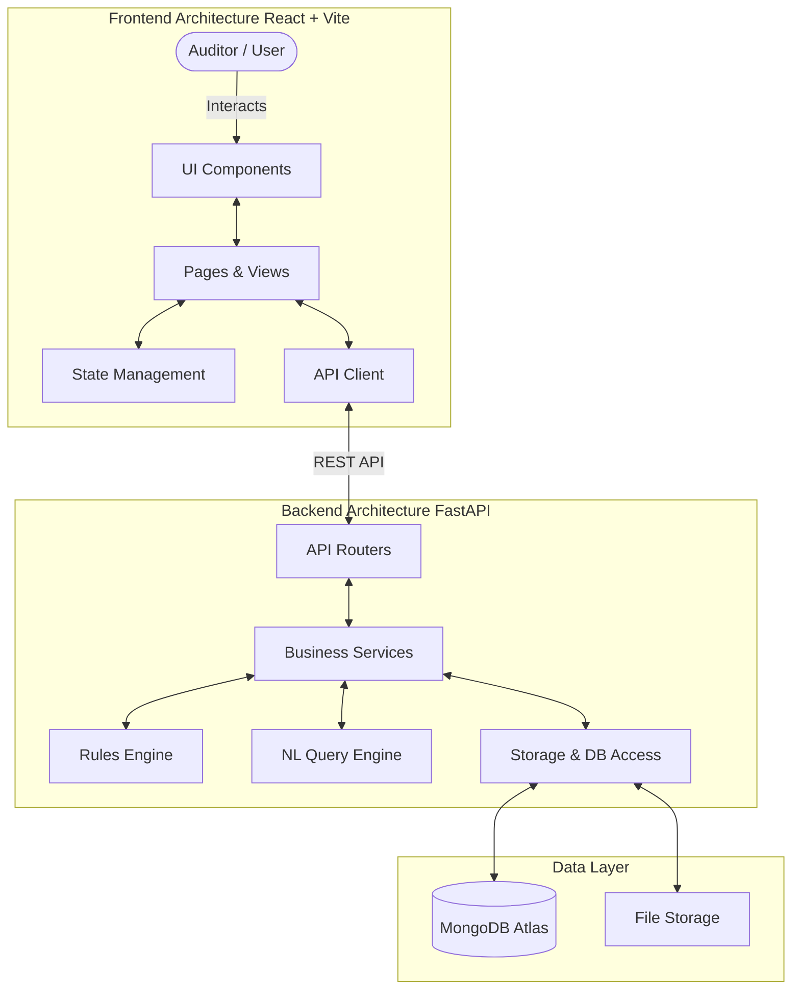
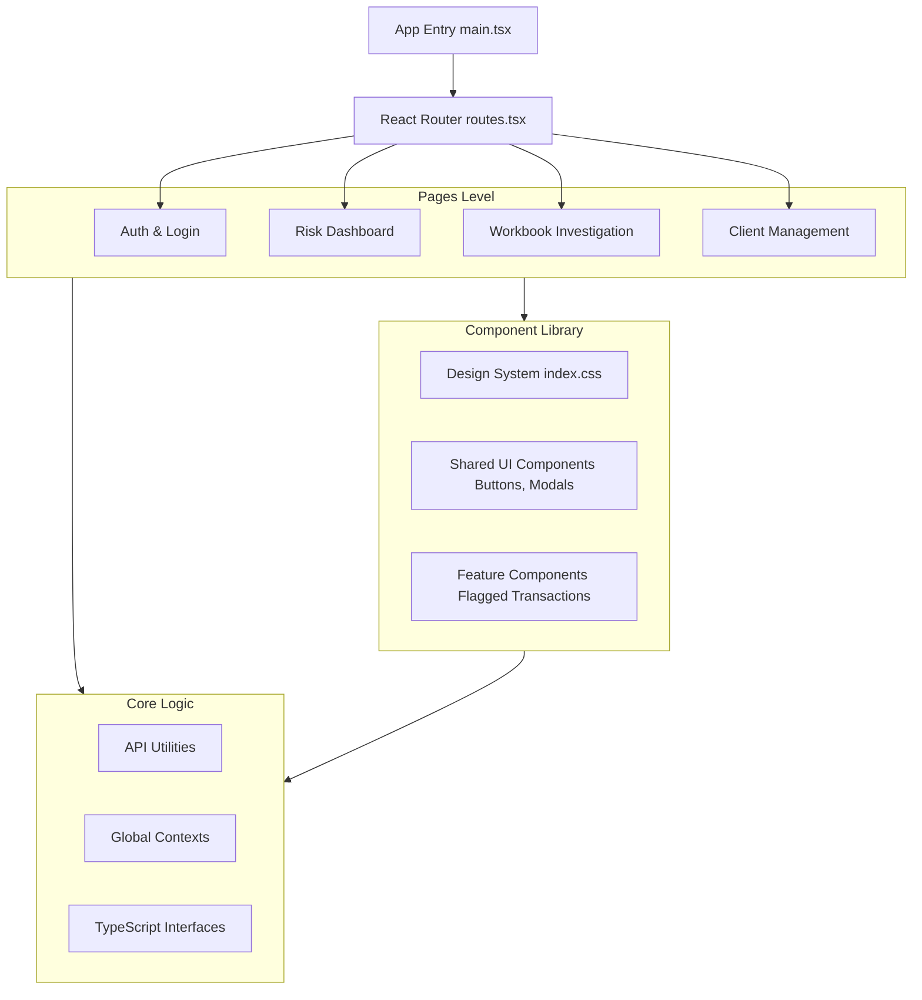

# Ledger Scrutiny Architecture Diagrams

## High-Level System Architecture



## Frontend Architecture



## Backend Architecture

```mermaid
graph TD
    Main[main.py FastAPI App]
    
    subgraph Routers [API Endpoints]
        AuthRouter[/api/auth]
        WorkbookRouter[/api/workbooks]
        ScrutinyRouter[/api/scrutiny]
        ClientRouter[/api/clients]
    end
    
    Main --> Routers
    
    subgraph Services [Business Logic]
        AuthService[Auth Service]
        WorkbookService[Workbook Service]
        ScrutinyService[Scrutiny Service]
        ClientService[Client Service]
        NLQueryService[Natural Language Query]
    end
    
    AuthRouter --> AuthService
    WorkbookRouter --> WorkbookService
    ScrutinyRouter --> ScrutinyService
    ClientRouter --> ClientService
    
    subgraph Engines [Processing Engines]
        RuleEngine[6-Rule Engine]
        MLEngine[Isolation Forest Machine Learning]
        QueryParser[NL Parser Intent & Constraints]
    end
    
    ScrutinyService --> RuleEngine
    ScrutinyService --> MLEngine
    NLQueryService --> QueryParser
    
    subgraph Data [Data Access]
        MongoDriver[MongoDB PyMongo]
        Schemas[Pydantic Models]
    end
    
    Services --> MongoDriver
    Services --> Schemas
```
